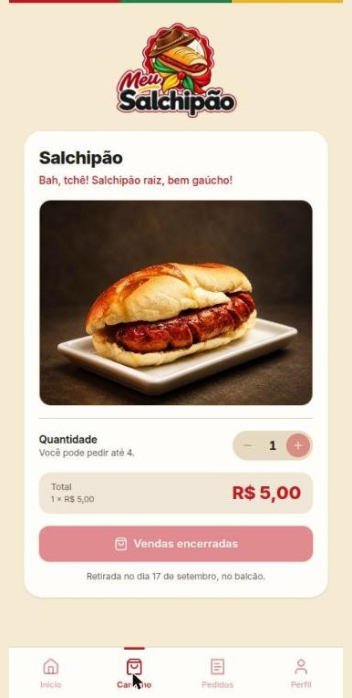
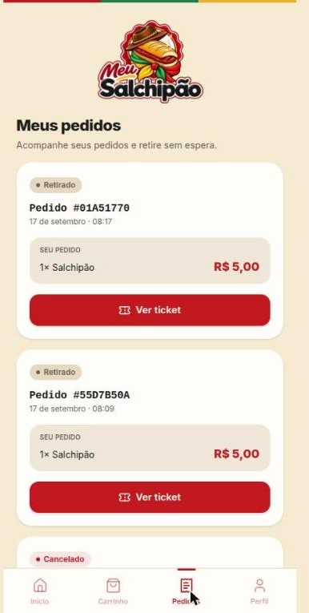
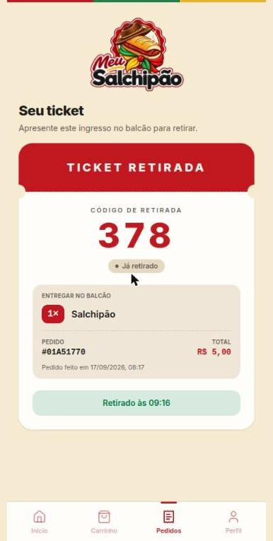
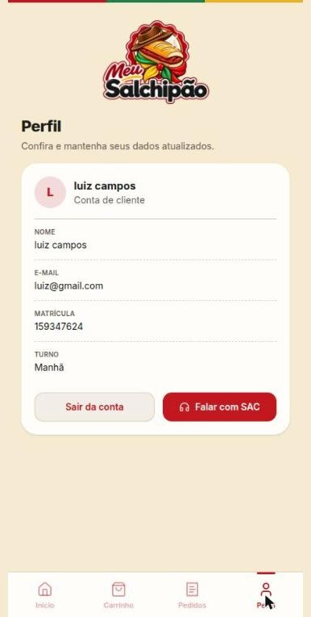
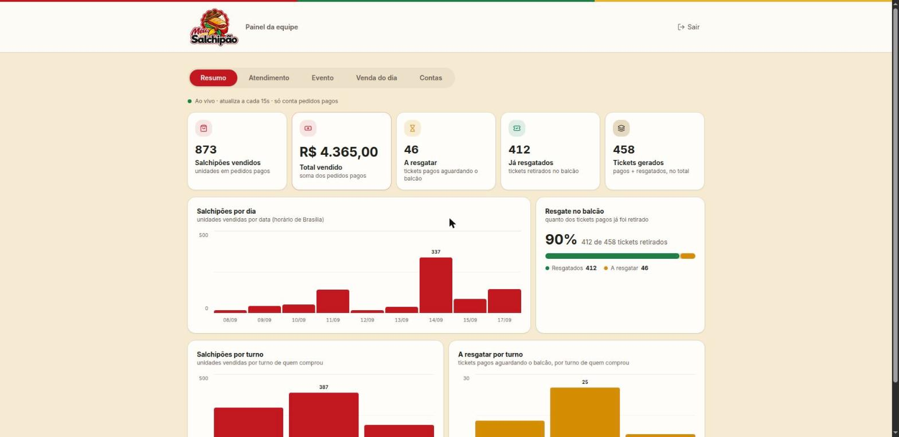
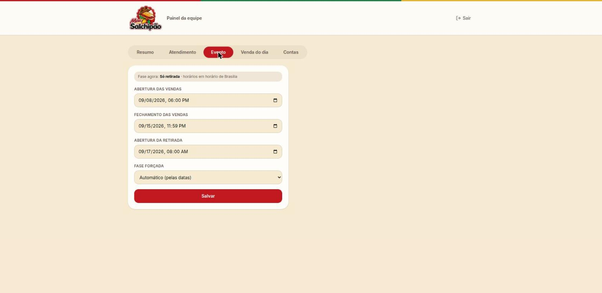
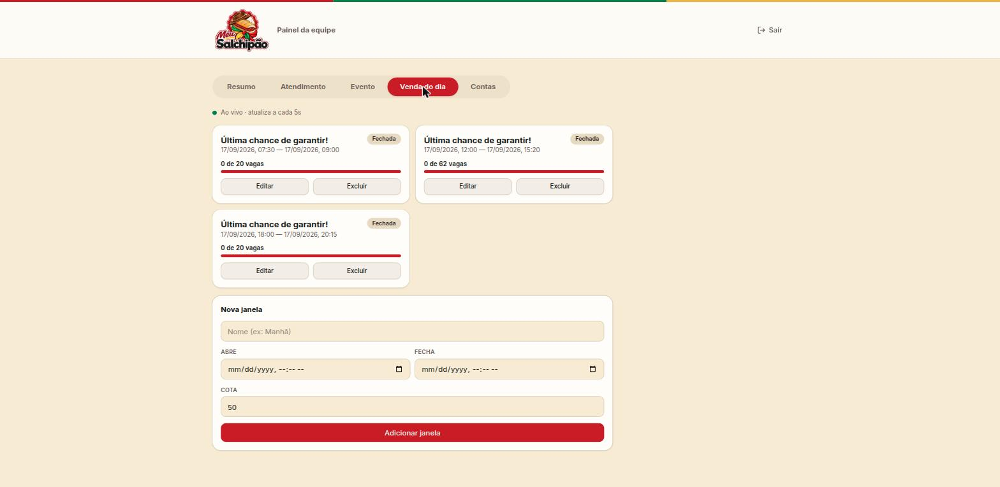
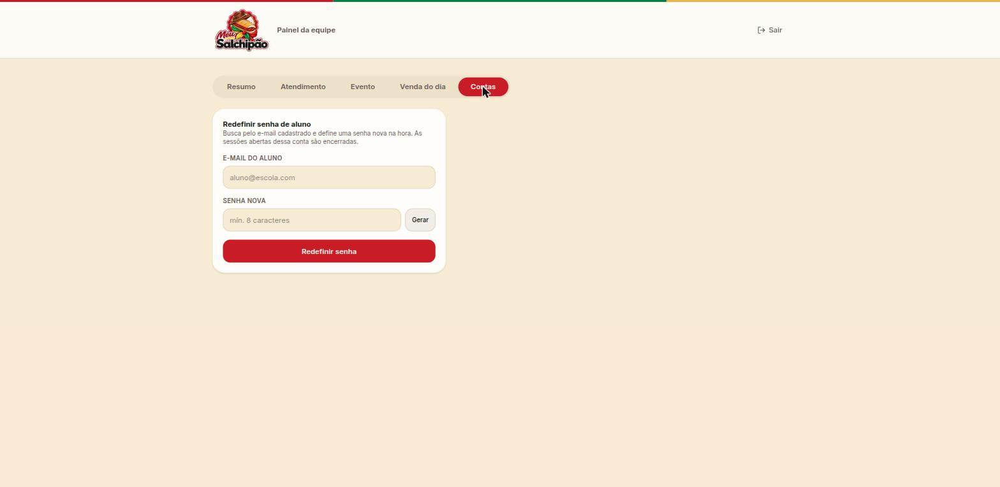

<div align="center">

# 🌭 Meu Salchipão

**Venda digital do lanche da Semana Farroupilha.**
O aluno ou colaborador se cadastra, faz o pedido, **paga por Pix via Mercado Pago dentro do app**
e recebe um **ticket digital** — resgatado no balcão com um toque de confirmação.

[](https://github.com/luizcamposss/meuSalchipao/actions/workflows/ci.yml)


</div>

---

## Sumário

- [O que é](#o-que-é)
- [Funcionalidades](#funcionalidades)
- [Telas](#telas)
- [Stack](#stack)
- [Arquitetura](#arquitetura)
- [Ciclo de vida do evento](#ciclo-de-vida-do-evento)
- [Venda avulsa do dia](#venda-avulsa-do-dia)
- [Autenticação](#autenticação)
- [Pagamento Pix + Webhook](#pagamento-pix--webhook)
- [Referência da API](#referência-da-api)
- [Modelo de domínio](#modelo-de-domínio)
- [Rodando localmente](#rodando-localmente)
- [Deploy e CI/CD](#deploy-e-cicd)
- [Configuração (`.env`)](#configuração-env)
- [Estrutura do repositório](#estrutura-do-repositório)
- [Decisões e tradeoffs](#decisões-e-tradeoffs)

---

## O que é

Sistema interno para a **Semana Farroupilha do SENAI/RS**. Digitaliza a compra do
"Salchipão": tira a fila do dinheiro, o troco e o vale-papel — o aluno paga pelo celular e
retira mostrando seu ticket.

O evento roda em **fases**. Há uma janela de venda; depois de uma data de corte as vendas
fecham e passa a valer só o resgate. **A API expõe a fase atual** — frontend e regras de
negócio reagem a ela **sem redeploy**. A equipe controla as datas (ou força uma fase) por um
painel.

**Monorepo:**

| Pasta | O quê |
|---|---|
| [`backend/`](backend/) | API — ASP.NET Core 8 Web API, monólito modular, MySQL |
| [`frontend/`](frontend/) | App — React 19 + Vite + TypeScript, SPA mobile-first |

---

## Funcionalidades

### App do aluno

- **Cadastro / login** com sessão em cookie `HttpOnly` (nenhum token no JavaScript).
- **Home dirigida pela fase** — antes da venda mostra contagem regressiva; na venda, o CTA de
  compra; na retirada, o atalho pro ticket; fechado, o aviso. Se uma **janela de venda avulsa**
  estiver aberta, um card de destaque aparece independente da fase, com o horário
  e as unidades restantes.
- **Montar o pedido** — 1 a 4 salchipões, total calculado no servidor, diálogo de confirmação.
- **Pagamento Pix** — QR + copia-e-cola, contagem até expirar, a tela **atualiza sozinha**
  quando o pagamento cai (polling do status).
- **Ticket digital** — código de retirada curto (`032`), QR, e um botão de **confirmação com
  diálogo de aviso** que o próprio aluno toca no balcão pra dar baixa (transição atômica, à
  prova de dois scans).
- **Meus pedidos** — lista com status contextual.
- **Atendimento (SAC)** — chat único com a equipe.
- **Perfil** — dados do cadastro.

### Painel da equipe (Staff)

Layout de desktop, 5 abas:

- **Resumo** — dashboard ao vivo (atualiza sozinho): salchipões vendidos, faturamento, tickets
  a resgatar/resgatados, e 4 gráficos (por dia, resgate no balcão, vendas por turno, a resgatar
  por turno — turno é o cadastrado no perfil de quem comprou).
- **Atendimento** — fila do SAC com filtro por status, prioridade (Alta em destaque), e o
  **detalhe do chamado lado a lado**: dados do aluno (nome, e-mail, matrícula, pedido), thread,
  resposta, e controle de status/prioridade.
- **Evento** — editar as três datas (abertura/fechamento de vendas, abertura da retirada) em
  **horário de Brasília** e forçar uma fase (`Auto / SalesOnly / RedemptionOnly / Closed`).
- **Venda do dia** — cadastra **janelas de venda avulsa** (nome, início, fim, cota) pro dia de
  retirada, com contador de vagas ao vivo. Ver [Venda avulsa](#venda-avulsa-do-dia) abaixo.
- **Contas** — redefine a senha de um aluno pelo e-mail (não há "esqueci minha senha"
  self-service; passa pela equipe).

---

## Telas

Prints reais do ambiente de produção, em `docs/screenshots/`.

### Aluno

| Home | Carrinho | Pedidos |
|---|---|---|
|  |  |  |

| Ticket | Perfil | SAC |
|---|---|---|
|  |  |  |

### Staff

| Resumo | Evento | Venda do dia | Contas |
|---|---|---|---|
|  |  |  |  |

> A aba **Atendimento** (SAC) não tem print aqui: a UI mestre-detalhe sempre abre um chamado ao
> carregar, e todo chamado real em produção expõe dados de um aluno (nome, e-mail, matrícula).

---

## Stack

| | Backend | Frontend |
|---|---|---|
| **Runtime** | .NET 8 / ASP.NET Core (controllers) | React 19 + Vite 8 + TypeScript |
| **Dados** | MySQL 8.4 · EF Core 8 + **Pomelo** (Code-First + Migrations) | **TanStack Query** (estado de servidor, polling, optimistic) |
| **Auth** | JWT (`JwtBearer`) em cookie + `PasswordHasher<T>` | cookie `credentials: 'include'`, 401 → refresh → retry |
| **Rotas** | — | React Router 7 |
| **Formulários** | DataAnnotations | React Hook Form + Zod |
| **UI** | — | Tailwind CSS v4 + **shadcn/ui** (Radix) · `lucide-react` · `motion` |
| **Mapeamento** | AutoMapper (um `Profile` por módulo) | — |
| **HTTP externo** | `HttpClient` tipado + `Microsoft.Extensions.Http.Resilience` | wrapper de `fetch` |
| **Config** | `.env` + **DotNetEnv** | `.env` (`VITE_API_URL`, build-time) |
| **Container** | Dockerfile multi-stage + Docker Compose | Dockerfile (build + nginx) |

---

## Arquitetura

```
                 ┌──────────────────────────┐
  navegador  ───▶│  Caddy (HTTPS, Let's Encrypt)
                 │   meusalchipao.online     ──▶  frontend (nginx serve o dist/)
                 │   api.meusalchipao.online ──▶  API (Kestrel, rede interna)
                 └──────────────────────────┘            │
   Mercado Pago  ──── webhook ────────────────────────────┤ (servidor→servidor)
                                                          ▼
                                                     MySQL (rede interna, volume)
```

### Backend — monólito modular

Um único projeto, um deploy, um `AppDbContext` — dividido em módulos de fronteira clara:

```
Auth · Catalog · Event · Orders · Payments · Sac
```

Cada módulo tem a mesma estrutura interna:

| Pasta | Papel |
|---|---|
| `Domain/` | entidades e enums — sem EF, sem HTTP |
| `Persistence/` | `IEntityTypeConfiguration<T>` — descoberto por `ApplyConfigurationsFromAssembly` |
| `Contracts/` | DTOs `record` — nunca se expõe entidade |
| `Services/` | lógica de aplicação (interface + implementação) |
| `Endpoints/` | controllers |
| `Mapping/` | `XMappingProfile : Profile` (scan do AutoMapper) |

As dependências apontam **para dentro**, para o `Domain`. Clean/Onion sem a cerimônia de
projetos separados. Os módulos já são as linhas de corte se um dia precisar dividir.

**Pipeline** (`Program.cs`, em ordem):
`UseExceptionHandler` → Swagger (dev) → `UseHttpsRedirection` → `UseCors` →
`UseAuthentication` → `UseAuthorization` → `UseRateLimiter` → `MapControllers`.

**Erros** — os services lançam exceções de domínio; o `GlobalExceptionHandler`
(`IExceptionHandler`) mapeia o **tipo** para o status e devolve **ProblemDetails** (RFC 7807):

| Exceção | Status |
|---|---|
| `ValidationException` | `400` |
| `AuthenticationException` | `401` |
| `NotFoundException` | `404` |
| `ConflictException` | `409` |
| `MercadoPagoException` | `502` |

### Frontend — SPA

`features/` por domínio (`auth`, `event`, `catalog`, `orders`, `payments`, `sac`), cada um com
`api.ts` + `hooks.ts` (TanStack Query). `pages/` são finos e compõem as features. Cookie de
sessão: o cliente nunca vê o token; em `401` tenta `POST /auth/refresh` uma vez, repete a
request, e só então manda pro `/login`. Guards de rota por papel (`RequireAuth`,
`RequireStaff`).

---

## Ciclo de vida do evento

`event_settings` é **uma linha única** com três datas e um override manual. `EventPhaseService`
calcula a partir do `TimeProvider` (injetável → testável):

| Campo | Verdade quando |
|---|---|
| `salesOpen` | `SalesOpenAt <= agora < SalesCloseAt` |
| `redemptionOpen` | `agora >= RedemptionOpensAt` |

`forcedPhase` (setado pelo Staff via `PUT /event`) **sobrepõe** o cálculo por data:

| `forcedPhase` | `salesOpen` | `redemptionOpen` |
|---|---|---|
| `Auto` | segue as datas | segue as datas |
| `SalesOnly` | `true` | `false` |
| `RedemptionOnly` | `false` | `true` |
| `Closed` | `false` | `false` |

**Guards:**

- `POST /orders` e `POST /orders/{id}/payment` → exigem `salesOpen`, senão **409**.
- `POST /orders/{id}/redeem` → exige `redemptionOpen`, senão **409**.

`GET /event` devolve `serverTime` — o frontend faz a contagem regressiva contra o **relógio do
servidor**, não o do cliente. As datas do evento são renderizadas fixas em `America/Sao_Paulo`.

> **Antes do evento:** a migration semeia datas de placeholder (`SalesOpenAt = 2026-09-08`
> etc). Ajuste no painel Staff ou via `PUT /event`.

---

## Venda avulsa do dia

No dia da retirada a equipe pode reabrir a venda por um tempo curto — pra quem chega sem ter
comprado antes — sem tirar o sistema da fase `RedemptionOnly` e **sem redeploy**.

- **`SaleWindow`** — não são "manhã/tarde" fixos no código: é uma **lista** (`sale_windows`,
  1-N com `event_settings`). O Staff cadastra quantas janelas quiser pela aba **Venda do dia**
  (nome livre, início, fim, cota).
- **`SalesOpen` volta a `true`** enquanto qualquer janela está com `agora` dentro do intervalo
  e vagas sobrando — mas só quando `forcedPhase == Auto` (um "fechado" forçado pelo Staff
  sempre vence). O campo `phase` **não muda** — continua `RedemptionOnly`, pra não confundir o
  front (que já reage a `phase`, não só a `salesOpen`).
- **Cota travada por incremento atômico** (`UPDATE ... WHERE Count < Cap`, mesma ideia do
  `redeem`) — testado sob concorrência real, sem overselling.
- `GET /event` devolve `saleWindows: [{ id, label, open, opensAt, closesAt, cap, remaining }]`.
  `POST /orders` reserva a vaga **depois** de validar o pedido, só se uma janela estiver aberta.

---

## Autenticação

**Dois tokens, papéis diferentes:**

| | Access token (JWT) | Refresh token (opaco) |
|---|---|---|
| Formato | JWT HMAC-SHA256, claims `sub`/`name`/`role`/`iss`/`aud`/`exp` | 32 bytes aleatórios, base64url |
| Vida | ~15 min | ~30 dias |
| Validação | assinatura + `exp`, **sem ir ao banco** | hash SHA-256 confere com a linha em `sessions` |
| Revogável | não | sim (apaga a linha) |
| Transporte | cookie `access_token` (`HttpOnly; Secure; SameSite=Lax`) | cookie `refresh_token` (+ `Path=/auth/refresh`) |

**Fluxo:** login emite os dois cookies → o `JwtBearer` lê o JWT **do cookie** e valida offline
→ access token expira → o cliente chama `POST /auth/refresh` (sozinho), o servidor **rotaciona**
a sessão (apaga a linha antiga, cria uma nova) e reescreve os cookies → logout apaga a sessão.

**Falha de credencial** → **um único 401 genérico** (não vaza quais emails existem).

**CSRF:** `SameSite=Lax` + allowlist estrita de CORS (`Cors:AllowedOrigins` + `AllowCredentials`).
Sem token antiforgery — decisão deliberada para o escopo.

**Rate limiting:**

| Policy | Limite | Onde |
|---|---|---|
| `auth` | 10 req / min por IP | `POST /auth/register`, `POST /auth/login` |
| `payment` | 5 req / min por usuário | `POST /orders/{id}/payment` |

> Atrás do Caddy, `UseForwardedHeaders` já está configurado (`Program.cs`) pro rate-limit por
> IP ver o cliente real, não o IP interno do proxy.

---

## Pagamento Pix + Webhook

Integração **direta** com o Mercado Pago (Checkout Transparente / Pix), sem o SDK. Duas
chamadas: `POST /v1/payments` e `GET /v1/payments/{id}`. **Sem estorno** ("pagou não volta, regra decidida no escopo").

### Criar a cobrança — `POST /orders/{id}/payment`

1. Pedido tem que ser do usuário e estar `AwaitingPayment`.
2. Já existe cobrança `Pending` viva? Devolve **essa** (nunca cria uma segunda).
3. Guard `salesOpen`.
4. `date_of_expiration = min(agora + 30min, SalesCloseAt)` — a cobrança **não sobrevive** ao
   fechamento das vendas. É isso que dispensa o estorno.
5. Persiste um **stub** `Payment` (`ExternalId = null`) **antes** de chamar o MP. O `Id` do stub
   é o `X-Idempotency-Key` — um retry reutiliza o stub, o MP devolve a mesma cobrança.
6. Chama o MP, preenche `ExternalId` + `PixCode` + `PixQrCodeBase64` + status, salva.
7. Devolve `{ paymentId, status, pixCode, pixQrCodeBase64, expiresAt, amount }`. O cliente
   renderiza o QR e faz *polling* em `GET /payments/{paymentId}`.

### Webhook — `POST /webhooks/mercadopago`

`[AllowAnonymous]` — o MP não manda JWT; **a assinatura é a autenticação**.

1. **Valida a assinatura** — header `x-signature` (`ts=...,v1=...`) + `x-request-id`; HMAC-SHA256
   do manifesto com `MercadoPago:WebhookSecret`, comparação em tempo constante. Não bate → **401**.
2. Não é evento de `payment` → **200** e ignora.
3. **Idempotência** — `EventId` já em `payment_webhook_events`? → **200** e sai.
4. **Busca o pagamento no MP** — o corpo do webhook **nunca** traz o status, só o id.
5. Se o pedido está `AwaitingPayment`:
   - MP `approved` → `Order.Status = Paid` + atribui o **número de retirada** sequencial.
   - MP `rejected` / `expired` → `Order.Status = Cancelled`.
6. Grava tudo **numa transação**. **200** rápido.

### `SalesCutoffWorker` (BackgroundService, a cada 2 min)

- `Payment` `Pending` vencido → `Expired`, pedido → `Cancelled`.
- Quando `agora >= SalesCloseAt` → **todo** pedido ainda `AwaitingPayment` → `Cancelled`.

---

## Referência da API

Base local: `http://localhost:5029`. Swagger em `/swagger` (dev).
Auth = cookie `access_token`. **Aluno** = qualquer logado; **Staff** = `Role = Staff`.

<details>
<summary><b>Auth · Catálogo · Evento</b></summary>

### `/auth`

| Método | Rota | Auth | Corpo | Respostas |
|---|---|---|---|---|
| POST | `/auth/register` | — (rate `auth`) | `{ name, email, enrollment, shift, password }` | `201` · `400` · `409` (email/matrícula em uso) |
| POST | `/auth/login` | — (rate `auth`) | `{ email, password }` | `200` + **cookies** · `401` |
| POST | `/auth/refresh` | cookie `refresh_token` | — | `200` + cookies novos · `401` (limpa cookies) |
| POST | `/auth/logout` | — | — | `204` |
| GET | `/auth/me` | aluno | — | `200` `{ id, name, email, enrollment, shift, role }` · `401` |
| POST | `/auth/staff/reset-password` | **Staff** (rate `auth`) | `{ email, newPassword }` | `200` `{ id, name, email, enrollment }` · `404` |

### `/products`

| Método | Rota | Auth | Respostas |
|---|---|---|---|
| GET | `/products` | público | `200` (só `Available == true`) |
| GET | `/products/{id}` | público | `200` · `404` |

### `/event`

| Método | Rota | Auth | Corpo | Respostas |
|---|---|---|---|---|
| GET | `/event` | público | — | `200` `{ salesOpen, redemptionOpen, phase, forcedPhase, salesOpenAt, salesCloseAt, redemptionOpensAt, serverTime, saleWindows }` |
| PUT | `/event` | **Staff** | `{ salesOpenAt, salesCloseAt, redemptionOpensAt, forcedPhase }` | `200` snapshot · `400` (`SalesOpenAt >= SalesCloseAt`) · `403` |
| POST | `/event/sale-windows` | **Staff** | `{ label, opensAt, closesAt, cap }` | `200` `{ id, label, open, opensAt, closesAt, cap, remaining }` · `400` |
| PUT | `/event/sale-windows/{id}` | **Staff** | idem | `200` idem · `400` · `404` |
| DELETE | `/event/sale-windows/{id}` | **Staff** | — | `204` · `404` |

`saleWindows` é a lista completa (aberta ou não); `remaining` já vem calculado
(`max(0, cap - vendidos)`). Ver [Venda avulsa do dia](#venda-avulsa-do-dia).

</details>

<details>
<summary><b>Pedidos · Pagamento</b></summary>

### `/orders`

| Método | Rota | Auth | Corpo | Respostas |
|---|---|---|---|---|
| POST | `/orders` | aluno | `{ items: [{ productId, quantity }] }` | `201` · `400` (vazio / qtd / > 4 itens / produto inexistente) · `409` (venda fechada / indisponível) |
| GET | `/orders` | aluno | — | `200` — só os meus |
| GET | `/orders/{id}` | dono / Staff | — | `200` · `404` |
| GET | `/orders/{id}/ticket` | dono / Staff | — | `200` `{ orderId, status, total, redeemedAt?, pickupNumber?, qrValue, items }` · `404` (não pago) |
| POST | `/orders/{id}/redeem` | **o próprio aluno** | — | `200` · `409` (retirada não aberta / não pago / já resgatado) · `404` |

O `redeem` é autenticado como o **próprio aluno** — ele confirma no próprio celular, no balcão,
com um diálogo de aviso antes. A transição é um `UPDATE ... WHERE Status = 'Paid'` atômico.

### `/orders/{id}/payment`, `/payments`

| Método | Rota | Auth | Respostas |
|---|---|---|---|
| POST | `/orders/{orderId}/payment` | dono (rate `payment`) | `201` `{ paymentId, status, pixCode, pixQrCodeBase64, expiresAt, amount }` · `409` · `404` · `502` (MP falhou) |
| GET | `/payments/{id}` | dono / Staff | `200` (polling) · `404` |
| POST | `/webhooks/mercadopago` | assinatura MP | `200` sempre (menos `401` assinatura inválida) |

### `/orders/stats`

| Método | Rota | Auth | Respostas |
|---|---|---|---|
| GET | `/orders/stats` | **Staff** | `200` `{ salchiposSold, revenue, ticketsToRedeem, ticketsRedeemed, ticketsGenerated, byDay, byShift, redeemByShift }` |

`byDay`/`byShift`/`redeemByShift` alimentam os 3 gráficos da aba **Resumo** — "vendido" conta
`Paid` + `Redeemed`; turno é o `Shift` cadastrado no perfil de quem comprou, não a janela de
venda avulsa.

</details>

<details>
<summary><b>SAC · Infra</b></summary>

### `/sac/tickets`

| Método | Rota | Auth | Corpo / Query | Respostas |
|---|---|---|---|---|
| POST | `/sac/tickets` | aluno | `{ subject, description, orderId? }` | `201` · `400` (orderId não é do usuário) |
| GET | `/sac/tickets` | aluno | — | `200` — só os meus |
| GET | `/sac/tickets/all` | **Staff** | `?status=` | `200` — fila + `userName`/`userEmail`/`userEnrollment` (High primeiro) |
| GET | `/sac/tickets/{id}` | dono / Staff | — | `200` thread + dados do aluno · `404` |
| POST | `/sac/tickets/{id}/messages` | dono / Staff | `{ message }` | `200` · `409` (`Closed`) · `404` |
| PATCH | `/sac/tickets/{id}` | **Staff** | `{ status?, priority? }` | `200` · `404` |

Auto-transições: staff responde num `Open` → `InProgress`; aluno responde num `Resolved` → `Open`.

### Infra

| Método | Rota | Descrição |
|---|---|---|
| GET | `/health` | `200 { status: "ok" }` |
| GET | `/swagger` | Swagger UI (só em Development) |

</details>

---

## Modelo de domínio

<details>
<summary><b>Tabelas e enums</b></summary>

| Tabela | Campos-chave | Observação |
|---|---|---|
| `users` | `Email` (único), `Enrollment` (único), `Shift`, `PasswordHash`, `Role`, `Active` | `email VARCHAR(191)` — limite de índice do InnoDB com utf8mb4 |
| `sessions` | `UserId`, `TokenHash` (SHA-256, único), `ExpiresAt`, `LastUsedAt` | guarda **refresh tokens** (hash) |
| `products` | `Name`, `Description`, `Price` (`DECIMAL(10,2)`), `Available` | seeded: "Salchipão" |
| `event_settings` | `SalesOpenAt`, `SalesCloseAt`, `RedemptionOpensAt`, `ForcedPhase` | **linha única** |
| `sale_windows` | `EventSettingsId`, `Label`, `OpensAt`, `ClosesAt`, `Cap`, `Count` | 1-N com `event_settings`; `Count` incrementado atomicamente |
| `orders` | `UserId`, `Total`, `Status`, `PaymentStatus`, `RedeemedAt?`, `PickupNumber?` | `Total` sempre calculado no servidor |
| `order_items` | `OrderId`, `ProductId`, `ProductName` (**snapshot**), `UnitPrice` (**snapshot**), `Quantity` | preço/nome congelados no pedido |
| `payments` | `OrderId`, `ExternalId?` (único), `Status`, `Amount`, `PixCode?`, `PixQrCodeBase64?`, `ExpiresAt` | `ExternalId` nulável — nasce como *stub* |
| `payment_webhook_events` | `EventId` (único), `PaymentId`, `Action`, `ProcessedAt` | idempotência do webhook |
| `sac_tickets` | `UserId`, `OrderId?`, `Subject`, `Description`, `Status`, `Priority` | |
| `sac_messages` | `TicketId`, `SenderId`, `FromStaff`, `Message`, `CreatedAt` | `FromStaff` = snapshot do papel |

Todo enum é gravado como **string** (`.HasConversion<string>()`) e serializado como **nome** no
JSON. Começam em `1` — o `0` (`Undefined`) é sentinela de "não setado".

```
Role              : Student | Staff
Shift             : Morning | Afternoon | Evening
OrderStatus       : AwaitingPayment → Paid → Redeemed | Cancelled
PaymentStatus     : Pending → Approved | Rejected | Expired | Refunded
ForcedPhase       : Auto | SalesOnly | RedemptionOnly | Closed
SacTicketStatus   : Open → InProgress → Resolved → Closed
SacTicketPriority : Low | Normal | High
```

**`Order.Status`:**

```
AwaitingPayment ──(webhook: approved)──▶ Paid ──(POST /redeem)──▶ Redeemed
       │
       └──(webhook: rejected/expired · ou SalesCutoffWorker no fechamento)──▶ Cancelled
```

</details>

---

## Rodando localmente

**Requisitos:** .NET 8 SDK · Node 20+ · Docker

### Backend

```bash
cd backend
cp .env.example .env          # preencha os valores
docker compose up -d meuSalchipao    # só o MySQL
dotnet run                    # aplica as migrations no startup → :5029
```

Swagger: `http://localhost:5029/swagger` · Health: `GET /health`.
Rode `dotnet run` e o `dotnet ef` **de dentro de `backend/`** (a app carrega o `.env` do cwd).

### Frontend

```bash
cd frontend
npm install
npm run dev                   # :5173, com proxy /api → :5029
```

O `vite.config.ts` faz o proxy de `/api` pro backend em dev (zero CORS) e reescreve o `Path`
do cookie de refresh.

### Webhook do Mercado Pago em dev

O MP precisa alcançar `POST /webhooks/mercadopago` — use um túnel:

```bash
ngrok http 5029
# cole a URL https em MercadoPago__NotificationBaseUrl no .env, e reinicie a API
```

### Migrations

```bash
cd backend
dotnet ef migrations add <Nome> -o Migrations
dotnet ef database update
```

A app também roda `Database.Migrate()` no startup (ok para uma instância).

---

## Deploy e CI/CD

Produção com **Docker Compose + Caddy** (HTTPS automático via Let's Encrypt) na VM.

| Serviço | Papel |
|---|---|
| `caddy` | 80/443 — roteia `meusalchipao.online` → `web` e `api.meusalchipao.online` → `api` |
| `web` | nginx servindo o `dist/` do frontend (SPA fallback) |
| `api` | Kestrel, `ASPNETCORE_ENVIRONMENT=Production`, só na rede interna |
| `db` | MySQL, só interno, volume |

Passos (resumo):

1. DNS — `A meusalchipao.online` e `A api.meusalchipao.online` → IP da VM.
2. Na VM: `git clone`, criar o `.env` de produção **na raiz do repo** (ver [`.env.example`](.env.example)) — é esse arquivo que o `docker-compose.prod.yaml` lê, não o `backend/.env`.
3. `docker compose -f docker-compose.prod.yaml up -d --build`.
4. Painel do Mercado Pago → cadastrar o webhook `https://api.meusalchipao.online/webhooks/mercadopago`,
   evento `payment`, copiar o secret pro `.env`.
5. Criar os usuários Staff direto no banco (via Beekeeper/túnel SSH, não há seed automático nem
   endpoint de auto-registro) e definir as datas reais do evento no painel Staff.

> O `VITE_API_URL` é **build-time** — entra como build-arg na imagem do frontend.

### CI/CD (GitHub Actions)

`.github/workflows/ci.yml`, dois estágios:

- **CI** — todo push/PR builda backend (`dotnet build`) e frontend (`npm run lint` +
  `npm run build`) em paralelo. Sem step de teste — não existe suíte ainda.
- **CD** — `push` em `main`, só depois do CI passar: entra na VM por SSH (chave dedicada só
  pra isso, guardada como secret do GitHub — direção oposta e sem relação com a deploy key
  read-only que a própria VM usa pra clonar o repo) e roda
  `git pull && docker compose -f docker-compose.prod.yaml up -d --build`. Nenhum segredo de
  aplicação passa pelo GitHub — o `.env` de produção nunca sai da VM.

---

## Configuração (`.env`)

**Dois arquivos `.env` diferentes, não confundir:**

- **`backend/.env`** (gitignored) — desenvolvimento local: alimenta `dotnet run` e o
  `backend/docker-compose.yaml` (só o container do MySQL). Modelo:
  [`backend/.env.example`](backend/.env.example).
- **`.env` na raiz do repo** (gitignored) — produção: alimenta o `docker-compose.prod.yaml`
  inteiro (Caddy, frontend, API, banco). Modelo: [`.env.example`](.env.example).

Em ambos, `__` (duplo underscore) vira `:` na config do .NET (`Jwt__SigningKey` → `Jwt:SigningKey`).
A tabela abaixo é do `backend/.env` (dev local); o `.env.example` da raiz documenta as chaves
equivalentes de produção.

| Grupo | Chaves |
|---|---|
| Banco | `DB_NAME` · `DB_USER` · `DB_USER_PASSWORD` · `DB_ROOT_PASSWORD` · `DB_PORT` · `ConnectionStrings__DefaultConnection` |
| API | `ASPNETCORE_ENVIRONMENT` · `API_PORT` |
| JWT | `Jwt__SigningKey` · `Jwt__Issuer` · `Jwt__Audience` |
| CORS | `Cors__AllowedOrigins` |
| Mercado Pago | `MercadoPago__AccessToken` · `MercadoPago__WebhookSecret` · `MercadoPago__NotificationBaseUrl` |
| Deploy | `DOMAIN_APP` · `DOMAIN_API` · `VITE_API_URL` · `ACME_EMAIL` |

---

## Estrutura do repositório

```
.
├─ backend/
│  ├─ Program.cs                    # composition root: DI, pipeline, hosted services
│  ├─ Dockerfile · docker-compose.yaml
│  ├─ Migrations/
│  ├─ Shared/
│  │  ├─ Persistence/AppDbContext.cs
│  │  └─ Exceptions/                # exceções de domínio + GlobalExceptionHandler
│  └─ Modules/
│     ├─ Auth/      · Catalog/  · Event/
│     ├─ Orders/    · Payments/ (Gateway/ · BackgroundJobs/)
│     └─ Sac/
│        cada um: Domain/ · Persistence/ · Contracts/ · Services/ · Endpoints/ · Mapping/
│
└─ frontend/
   ├─ index.html · vite.config.ts · Dockerfile
   ├─ scripts/optimize-assets.mjs   # gera webp + favicons a partir de src/assets/raw/
   └─ src/
      ├─ app/         router · providers · guards · layouts
      ├─ pages/        componentes finos de rota (+ pages/staff/)
      ├─ features/     auth · event · catalog · orders · payments · sac  (api.ts + hooks.ts)
      ├─ components/   ui/ (shadcn) · compartilhados
      ├─ lib/          api.ts (fetch + refresh) · queryClient · format (Intl pt-BR / SP)
      └─ types/api.ts  DTOs espelhando o backend
```

---

## Decisões e tradeoffs

| Decisão | Por quê |
|---|---|
| **Monólito modular**, não microserviços | 1 produto, 1 evento, poucos endpoints. Microserviços trariam transações distribuídas e orquestração sem ganho. Os módulos já são as linhas de corte. |
| **`.env` + DotNetEnv**, não `user-secrets` | O Compose lê `.env` nativamente. Um arquivo é fonte única para API **e** container. |
| **`PasswordHasher<T>` sozinho**, não ASP.NET Identity | Só precisamos do hasher. O Identity imporia schema e modelo de sessão que brigariam com o JWT-em-cookie custom. |
| **JWT em cookie `HttpOnly`**, não header `Authorization` | O JS nunca toca o token → XSS não rouba. Custo: CSRF (mitigado por `SameSite=Lax` + CORS). |
| **Refresh token opaco no banco** + JWT stateless | Revogabilidade (apaga a linha) com validação rápida por request (só assinatura). |
| **`MercadoPagoClient` HTTP tipado**, não o SDK | O SDK usa config global estática, cria o próprio `HttpClient` e é difícil de fakear. Usamos 2 chamadas. |
| **Sem estorno automático** | "Pagou não volta." O `date_of_expiration` limitado ao `SalesCloseAt` torna "aprovado depois do fechamento" quase impossível. |
| **Snapshot de nome/preço em `OrderItem`** | O pedido é registro histórico — reflete o que foi pago mesmo se o preço mudar depois. |
| **`Total` calculado no servidor** | O request não tem campo `total`. Senão alguém pediria 50 e mandaria `total: 0.01`. |
| **`TimeProvider` injetado** | Decisões de fase/expiração dependem de "agora" — injetável = testável. |
| **Auto-migrate no startup** | `docker compose up` de um banco limpo já sobe com schema e dados de catálogo/evento em dia (`HasData` nas migrations). Usuários Staff não são semeados — credencial hardcoded no código é risco de segurança; criação é manual, direto no banco. |
| **Front: TanStack Query como store** | Estado de servidor com cache, polling e optimistic sem Redux. `useState` só pra UI local. |
| **Front: shadcn/ui (componentes copiados)** | Código que a gente edita, Tailwind legível — não uma caixa-preta de theming. |
| **Datas do evento em `America/Sao_Paulo` fixo** | O aluno vê a data certa independente do fuso do aparelho; o backend guarda UTC. |
| **`sale_windows` como lista**, não colunas fixas (`MorningOpensAt`...) | Staff cadastra quantas janelas quiser, com o nome que quiser, sem depender de código novo ou deploy a cada mudança de plano. |
